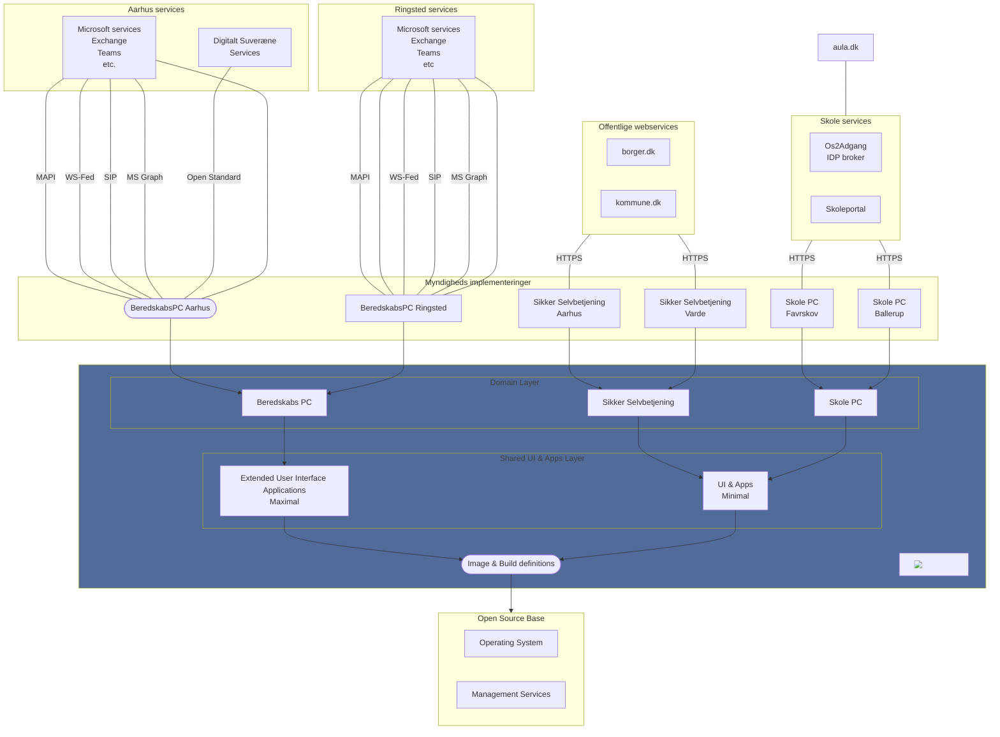

# Solution Landscape Diagram

```mermaid
flowchart TB
 subgraph Base["Open Source Base"]
        OS["Operating System"]
        Management["Management Services"]
  end
   subgraph UIApps["Shared UI &amp; Apps Layer"]
         UI1["UI &amp; Apps<br>Minimal"]:::darkText
         UI2["Extended User Interface Applications<br>Maximal"]:::darkText
   end
   subgraph Domains["Domain Layer"]
          D1["Sikker Selvbetjening"]:::darkText
          D3["Skole PC"]:::darkText
          D4["Beredskabs PC"]:::darkText
   end
 subgraph TopLevel["Myndigheds implementeringer"]
        T1(["BeredskabsPC Aarhus"])
        T2["BeredskabsPC Ringsted"]
        T3["Sikker Selvbetjening<br>Aarhus"]
        T4["Sikker Selvbetjening<br>Varde"]
        T5["Skole PC<br>Favrskov"]
        T6["Skole PC<br>Ballerup"]
  end
 subgraph s2["Offentlige webservices"]
        n1["borger.dk"]
        n2["kommune.dk"]
  end
 subgraph s4["Skole services"]
        n17["Os2Adgang<br>IDP broker"]
        n19["Skoleportal"]
  end
  subgraph s1[" "]
         UIApps
         Domains
         Image(["Image &amp; Build definitions"])
          logo["<img src='https://www.os2.eu/web/image/website/1/logo/OS2%20%E2%80%93%20Offentligt%20digitaliseringsf%C3%A6llesskab?unique=14a6e62'/>"]
   end
 subgraph s5["Aarhus services"]
        n20["Microsoft services<br>Exchange<br>Teams<br>etc."]
        n24["Digitalt Suveræne<br>Services"]
  end
 subgraph s6["Ringsted services"]
        n21["Microsoft services<br>Exchange<br>Teams<br>etc"]
  end
    D1 --> UI1
    D3 --> UI1
    D4 --> UI2
    T1 --> D4
    T2 --> D4
    T3 --> D1
    T4 --> D1
    T5 --> D3
    T6 --> D3
    s2 -- HTTPS --- T3 & T4
    s4 -- HTTPS --- T5 & T6
    UI2 --> Image
    Image --> Base
    UI1 --> Image
    n18["aula.dk"] --- s4
    n21 -- MAPI --- T2
    n21 --- T2
    n21 -- "WS-Fed" ---- T2
    n21 -- SIP --- T2
    n21 -- MS Graph --- T2
    n20 -- MAPI --- T1
    n20 -- "WS-Fed" ---- T1
    n20 -- SIP --- T1
    n20 -- MS Graph --- T1
    n24 -- Open Standard --- T1
    n20 --- T1
    n21 --- T2
    style s1 fill:#526c9a,color:#424242
    style Domains fill:#526c9a,color:#424242
    style UIApps fill:#526c9a,color:#424242
```

---
